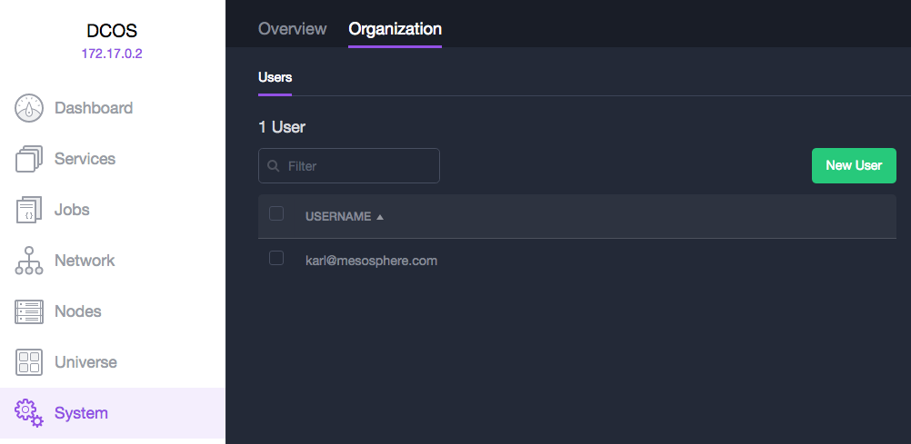

# DC/OS 101 - GUI & CLI

## Intro

- Website: <https://dcos.io/>
- Source: <https://github.com/dcos/dcos>
- Docs: <https://dcos.io/docs/1.8/>
- Install Instructions: <https://dcos.io/install/>
- Release Notes & Downloads: <https://dcos.io/releases/>
- DC/OS Intro Video: <https://mesosphere.com/resources/dcos-demo/>

## GUI

TODO: move description to slides
The DC/OS Web GUI is the primary visual control interface for observing and managing your cluster.

### GUI - Log In

Visit the IP of a DC/OS master node (or a master node load balancer) in a browser.


Log in with a supported OAuth-compatible account (Google, Github, or Microsoft).

The first user to log in will have a new account created for them automatically.

### GUI - Create Accounts

Once the first account has been created, new users must be invited by a current user.

To invite users, navigate to the `System` page, select the `Organization` tab, select `New User`,
enter the OAuth-compatible email of the new user, and select `Add User`.



The new user will shortly receive an email inviting them to log in to the cluster.

### GUI - Create Service

TODO: move description to slides
The Services page allows for creating, viewing, and managing services: long running, replicated processes.

Install MinitTwit as a DC/OS Service.

1. Select `Services` in the left navigation panel to access the service list page
1. Select `Deploy Service` to open the service creation screen
1. On the `General` tab, enter a service `ID` unique to the cluster (e.g. `minitwit`)
1. On the `General` tab, enter the amount of `Memory` to allocate to the service (e.g. `256`)
1. On the `Container Settings` tab, enter the name or url of a `Container Image` (e.g. `karlkfi/minitwit`)
1. On the `Network` tab, select `Bridge` as the `Network Type`
1. On the `Network` tab, under `Service Endpoints`, enter the `Container Port` used by the service container (e.g. `80`)
1. On the `Optional` tab, under `Accepted Resource Roles`, enter `slave_public` to constrain deployment to public nodes
1. In JSON Mode, under `container.docker.portMappings[0]`, add `"hostPort": 80,` to specify which host port to use
1. In JSON Mode, add `"requirePorts": true,` so that the service will only be deployed to nodes that have the specified host port available.
1. Select `Deploy` to deploy the service

### GUI - Locate Service Endpoint

1. Select `Services` in the left navigation panel to access the service list page
1. Select the name of the deployed service (e.g. `minitwit`) to access the service detail page
1. Select the `Task ID` of the task with status `Running` to access the task detail page
1. Select the first link in the `Endpoints` list to access the service itself

### GUI - Destroy Service

1. Select `Services` in the left navigation panel to access the service list page
1. Hover over the name of the deployed service (e.g. `minitwit`) to show the service actions button
1. Select the service actions button to show a dropdown of service actions
1. Select `Destroy` to destroy the service and its tasks


TODO: Health Check
TODO: Marathon-LB


## CLI

The DC/OS CLI is the primary programmatic control interface for observing and managing your cluster.

## CLI - Install

    Follow the platform-specific instructions in the UI for installing and configuring the CLI.
    

    Use the Linux instructions if you're SSHed into a Linux VM.

    TODO: do the Windows instructions work in GitBash?

1. CLI - Log in

    ```
    $ dcos auth login
    ```

    Follow instructions to retrieve OAuth token via a browser.

### CLI - Create Service

Install MinitTwit as a new Service.

TODO: instructions

```
{
  "id": "/minitwit",
  "instances": 1,
  "cpus": 1,
  "mem": 256,
  "container": {
    "docker": {
      "image": "karlkfi/minitwit",
      "forcePullImage": false,
      "privileged": false,
      "portMappings": [
        {
          "hostPort": 80,
          "containerPort": 80,
          "protocol": "tcp"
        }
      ],
      "network": "BRIDGE"
    }
  },
  "acceptedResourceRoles": [
    "slave_public"
  ],
  "requirePorts": true
}
```

### CLI - Locate Service Endpoint

TODO: instructions

### CLI - Destroy Service

TODO: instructions
