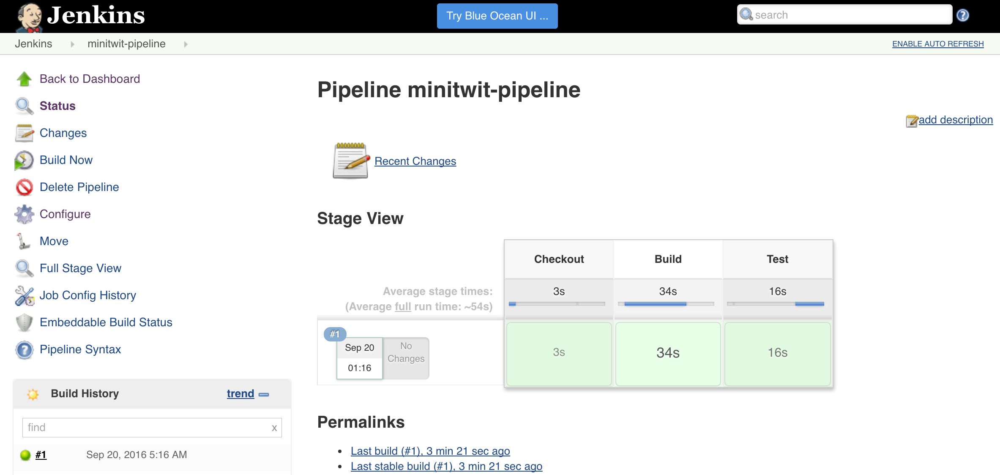
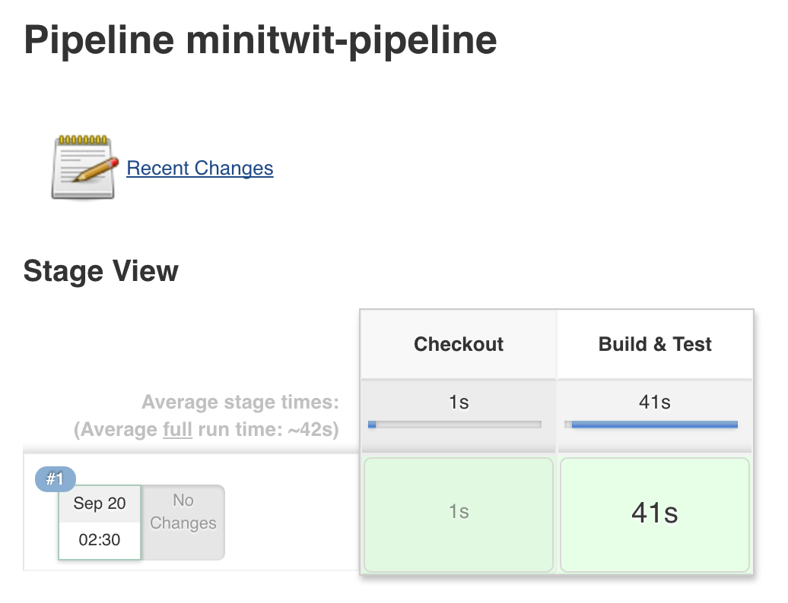

# Jenkins 102 - Pipelines

## Agenda

- [Intro](#intro)
- [Parallel Stages](#parallel-stages)
- [Parallel Nodes](#parallel-nodes)
- [Artifacts &amp; Stashes](#artifacts--stashes)

## Intro

A recent addition to Jenkins is the pipeline plugin.
This plugin allows for creating groovy scripts that orchestrate a potentially complex series of optionally parallel build stages.

For a great, short overview of the Jenkins Pipeline Plugin, check out the [CloudBees blog post on continuous delivery](http://udaypal.com/2015-04-08-continuous-delivery-using-jenkins-workflow/).

For this lab, we'll be making a pipeline to build and test MiniTwit.


1. Select `New Item` in the left nav to open the project creation page
1. Enter a project name into the test field (e.g. `minitwit-pipeline`)
1. Select `Pipeline` and `OK` to create the project and open the job configuration page


Now that the pipeline is created, it needs to be configured.

1. Under `Pipeline`, enter a groovy pipeline script to execute:

    ```
    node {
      stage 'Checkout'
      git url: 'http://github.com/karlkfi/minitwit'

      stage 'Build'
      sh 'docker build -t karlkfi/minitwit .'

      stage 'Test'
      sh 'docker run --rm -v "$PWD":/usr/src/app -w /usr/src/app maven:3.3.9-jdk-8-alpine mvn test'
    }
    ```
1. Select `Save` to confirm config changes and open the project detail page

Now that the pipeline is configured, it can be run!

1. Select `Build Now` in the left nav to add a build to the queue

    The build should immediately show up under `Build History`.
    Once the build has started, a progress bar will appear next to the build number in the build history.
1. Select the progress bar to open the build console log
1. Watch the log tail until it completes - SUCCESS!



Now that the pipeline works, the pipline script can be enhanced to actually build and test MiniTwit!

## Parallel Stages

New with pipelines is the ability to execute parallel tasks and wait for them to complete before continuing.

1. On the project detail page, select `Configure` to open the job configuration page
1. Update the pipeline script:

    ```
    node {
      stage 'Checkout'
      git url: 'http://github.com/karlkfi/minitwit'

      parallel (
        'Build': {
          sh 'docker build -t karlkfi/minitwit .'
        },
        'Test': {
          sh 'docker run --rm -v "$PWD":/usr/src/app -w /usr/src/app maven:3.3.9-jdk-8-alpine mvn test'
        }
      )
    }
    ```

1. Select `Save` to confirm config changes and open the project detail page
1. Select `Build Now` in the left nav


**Warning**: This may exceed the default node memory and be terminated. If you see the following, you'll need to configure the Jenkins "nodes" more memory.

> [Build] Killed
> [Build] The command '/bin/sh -c mvn package' returned a non-zero code: 137

TODO: configure nodes memory

## Parallel Nodes

Pipelines also have the ability to execute steps on multiple nodes in parallel.

1. On the project detail page, select `Configure` to open the job configuration page
1. Update the pipeline script:

    ```
    stage 'Build & Test'
    parallel (
      'Build' : {
        node {
          git url: 'http://github.com/karlkfi/minitwit'
          sh 'ci/build.sh'
        }
      },
      'Test' : {
        node {
          git url: 'http://github.com/karlkfi/minitwit'
          sh 'ci/test-unit.sh'
        }
      }
    )
    ```

1. Select `Save` to confirm config changes and open the project detail page
1. Select `Build Now` in the left nav

TODO: pic

Unfortunately, parallel node steps don't show up as seperate in the GUI yet.

## Artifacts & Stashes

Jenkins has two concepts of being able to save and retrieve files produced by jobs.

- **Artifacts** are stored permenantly, used for saving job output
- **Stashes** are stored temporarily, used for passing job output as input to a later job in a pipeline

Both artifacts and stashes are shipped from the agent node where they were created to the master for storage.  However, they are also options for [storing artifacts in AWS S3](https://github.com/jenkinsci/s3-plugin), which is a great option for publishing package builds and releases.

For example, one method to improve the parallel node pipeline would be to checkout the source up front and stash it for the parallel steps so they aren't duplicating effort.

Try this pipeline script with stash/unstash:

```
stage 'Checkout'
node {
  git url: 'http://github.com/karlkfi/minitwit'
  stash 'source'
}

stage 'Build & Test'
parallel (
  'Build' : {
    node {
      unstash 'source'
      sh 'ci/build.sh'
    }
  },
  'Test' : {
    node {
      unstash 'source'
      sh 'ci/test-unit.sh'
    }
  }
)
```



## Integration Test

The next logical step is to test the integration of system components.
In this case we have two use cases:

- Development: MiniTwit + HyperSQL (in-memory)
- Production: MiniTwit + MySQL

One test scenario looks the same for both:

1. Create account
1. Log in
1. Post a message
1. See the new message in the list

See integration test for the dev scenario: <https://github.com/karlkfi/minitwit/blob/master/ci/test-integration.sh>

Create a pipeline with the current steps:

```
node {
  stage 'Checkout'
  git url: 'http://github.com/karlkfi/minitwit'

  stage 'Build'
  sh 'ci/build.sh'

  stage 'Unit Tests'
  sh 'ci/test-unit.sh'

  stage 'Integration Tests'
  sh 'ci/test-integration.sh'
}
```

BONUS: Can you copy and modify the integration test to work with MiniTwit & MySQL?

## Push to DockerHub

From the Jenkins homepage, navigate to the credential add page:

`Credentials` > `System` > `Global credentials` > `Add Credentials`


Now add your DockerHub credentials and select `OK`.

Then add the following stage to your pipeline:

```
node {
  def GITHUB_USER = 'you' // replace!
  def DOCKER_USER = 'you' // replace!
  def CREDENTIAL_ID = 'dockerhub-karlkfi' // replace!
  def DOCKER_EMAIL = 'you@example.com' // replace!

  stage 'Checkout'
  git url: "http://github.com/${GITHUB_USER}/minitwit"

  stage 'Build'
  withEnv(["DOCKER_IMG=${DOCKER_USER}/minitwit"]) {
    sh 'ci/build.sh'
  }

  stage 'Unit Tests'
  sh 'ci/test-unit.sh'

  stage 'Integration Tests'
  withEnv(["DOCKER_IMG=${DOCKER_USER}/minitwit"]) {
    sh 'ci/test-integration.sh'
  }

  stage 'DockerHub Login'
  withCredentials([[$class: 'UsernamePasswordMultiBinding', credentialsId: "${CREDENTIAL_ID}", usernameVariable: 'USERNAME', passwordVariable: 'PASSWORD']]) {
    sh "docker login --username '${USERNAME}' --password '${PASSWORD}' --email '${DOCKER_EMAIL}'"
  }

  stage 'DockerHub Push'
  sh "docker push ${DOCKER_USER}/minitwit"
}
```

Does it work?

BONUS: Check out the Marathon plugin and try to deploy minitwit back to Marathon to complete the continuous deployment cycle!

## Back to Index

[Velocity Training](README.md)
